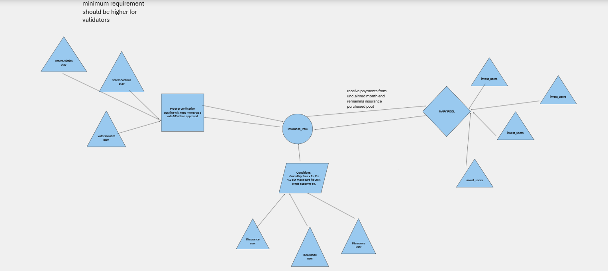

# 🛡️ SecureLeap

SecureLeap is a decentralized insurance platform built on the Internet Computer Protocol (ICP), empowering users with transparent, trustless, and community-driven coverage. It combines investor funding, validator governance, and insured user interaction through an on-chain dApp.



---

## ⚙️ Features

- **Internet Identity Authentication**  
  Secure login using Internet Identity.

- **Validator System (DAO-Like Voting)**  
  Validators stake ICP and vote on insurance claims. Claims get executed when 51% approval is reached.

- **Subscription-Based Insurance**  
  Users subscribe to the platform monthly, contributing to the **Insurance Pool**.

- **Claim Submission & Voting**  
  Users can submit claims; validators vote to approve/disapprove based on majority consensus.

- **Investor Incentives**  
  Investors provide liquidity to the **%APY Pool**, earning returns from unused insurance funds.

- **Smart Claim Verification**  
  Claims are only processed if approved by community governance.

---

## 💰 Token Flow

- **Insurance Pool:** Receives subscription payments.
- **APY Pool:** Funded by investors and gains from unclaimed insurance premiums.
- **Proof of Verification:** Claims are verified through validator consensus.
- **Subscription Flow:**  
  - Monthly fee `X`
  - Final pool = `X * 1.5`
  - Must ensure 60% of the pool remains for sustainability

---

## 🧱 Tech Stack

- **Frontend:** React + TailwindCSS
- **Backend:** Motoko / Rust (IC Canisters)
- **Authentication:** Internet Identity
- **ICP Ledger:** Used for payments, staking, and claim settlements
- **Canister Communication:** Via `dfx` and `@dfinity/agent`

---


To learn more before you start working with `insurancedapp`, see the following documentation available online:

- [Quick Start](https://internetcomputer.org/docs/current/developer-docs/setup/deploy-locally)
- [SDK Developer Tools](https://internetcomputer.org/docs/current/developer-docs/setup/install)
- [Rust Canister Development Guide](https://internetcomputer.org/docs/current/developer-docs/backend/rust/)
- [ic-cdk](https://docs.rs/ic-cdk)
- [ic-cdk-macros](https://docs.rs/ic-cdk-macros)
- [Candid Introduction](https://internetcomputer.org/docs/current/developer-docs/backend/candid/)

If you want to start working on your project right away, you might want to try the following commands:

```bash
cd insurancedapp/
dfx help
dfx canister --help
```

## Running the project locally

If you want to test your project locally, you can use the following commands:

```bash
# Starts the replica, running in the background
dfx start --background

# Deploys your canisters to the replica and generates your candid interface
dfx deploy
```

Once the job completes, your application will be available at `http://localhost:4943?canisterId={asset_canister_id}`.

If you have made changes to your backend canister, you can generate a new candid interface with

```bash
npm run generate
```

at any time. This is recommended before starting the frontend development server, and will be run automatically any time you run `dfx deploy`.

If you are making frontend changes, you can start a development server with

```bash
npm start
```

Which will start a server at `http://localhost:8080`, proxying API requests to the replica at port 4943.

### Note on frontend environment variables

If you are hosting frontend code somewhere without using DFX, you may need to make one of the following adjustments to ensure your project does not fetch the root key in production:

- set`DFX_NETWORK` to `ic` if you are using Webpack
- use your own preferred method to replace `process.env.DFX_NETWORK` in the autogenerated declarations
  - Setting `canisters -> {asset_canister_id} -> declarations -> env_override to a string` in `dfx.json` will replace `process.env.DFX_NETWORK` with the string in the autogenerated declarations
- Write your own `createActor` constructor
